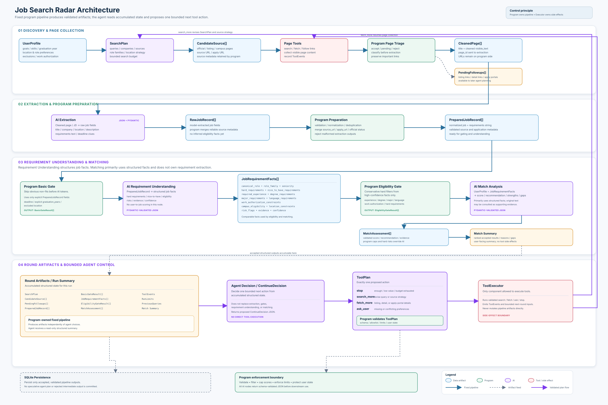

# Job Search Radar

## 1. Project Overview

**Job Search Radar** is an agent-based job discovery and matching system designed to support a more structured and adaptive job search workflow.

Instead of treating job search as a single search-and-filter operation, the system models it as a multi-step process involving query generation, source exploration, page retrieval, job extraction, job understanding, follow-up investigation, and candidate-job match assessment.

The system is coordinated by a central **Controller**, which determines what action should be executed next based on the current agent state, available information, execution limits, and accumulated results. A lightweight scheduling layer manages action priority, round-level execution budgets, result targets, refill behaviour, and explicit stopping conditions.

The current implementation focuses on three main capabilities:

- **Structured job discovery** across multiple search queries and external sources.
- **Adaptive multi-step exploration** that can continue investigating promising pages and follow-up links when additional information is needed.
- **Candidate-job match assessment** that produces structured evaluations based on job requirements and the candidate profile.

The project is implemented as an engineering prototype for exploring how an agent can coordinate job-search tasks under limited execution budgets while maintaining explicit control over state transitions, task scheduling, and stopping behaviour.

---

## 2. Motivation & Problem

Online job search often appears simple from the user side: enter a few keywords, open several job listings, compare requirements, and decide whether to apply. In practice, the process quickly becomes fragmented and repetitive.

Relevant positions may be distributed across company career pages, recruitment platforms, search-engine results, and secondary pages linked from an initial listing. Job descriptions also vary significantly in structure and detail. Some pages provide complete requirements immediately, while others require additional navigation or interpretation before the role can be properly evaluated.

For a candidate, this creates several recurring problems:

- **Search results contain substantial noise.** Keyword matching alone often surfaces roles that are only loosely related to the intended target.
- **Useful information is distributed across multiple pages.** A single search result may not contain enough information to understand the actual role.
- **Job descriptions are inconsistent.** Titles, responsibilities, technical requirements, and eligibility criteria may be expressed differently across companies.
- **Manual comparison is expensive.** Each role must be interpreted against the candidate's background, project experience, technical stack, and preferences.
- **Exploration can become unbounded.** Following every possible link or issuing too many follow-up searches increases latency and cost without necessarily improving the final result.

These limitations make job discovery a useful setting for studying **controlled multi-step agent behaviour**.

Job Search Radar therefore treats job search not simply as an information-retrieval problem, but as a constrained decision process. The system must decide:

1. what information is currently missing,
2. which action is most valuable to execute next,
3. whether additional exploration is justified,
4. how much execution budget should be allocated,
5. and when the search should stop.

The goal of the project is not to fully automate the entire recruitment process. Instead, it focuses on building a transparent and controllable workflow that can reduce repetitive search effort, organize job information into structured representations, and provide more consistent candidate-job match assessments.

## 3. Key Features

### 3.1 Adaptive Multi-step Job Search

Job Search Radar treats job discovery as a multi-step exploration process rather than a one-off keyword search.

The system can continue searching, retrieve relevant pages, fill in missing information, and decide whether further exploration is necessary based on the information already collected. The workflow is not constrained to a fixed execution sequence and can adapt dynamically as the search progresses.

---

### 3.2 State-driven Agent Control

A central Controller manages the overall execution flow.

The Controller evaluates the current agent state, available results, user information, and execution constraints to determine which actions are currently valid and what should be executed next.

This makes agent behaviour more explicit and controllable, reducing reliance on unconstrained model decisions while making complex multi-step workflows easier to debug and extend.

---

### 3.3 Dynamic Task Scheduling and Execution Budgets

The system dynamically schedules pending tasks based on current search progress, task value, and remaining execution budget rather than processing tasks in a fixed order.

Each round is governed by an explicit result target and step budget, with limited refill capacity when additional exploration is justified.

When further exploration is unlikely to provide sufficient value, or when execution limits are reached, the system stops the current search process. This provides a practical balance between search coverage and execution cost.

---

### 3.4 Layered Context and Structured Information Flow

The system does not continuously pass the full execution history to every agent action.

Instead, context is organized into layers so that each action receives only the information required for its current responsibility. Structured data is used to pass search results, page information, job data, and analysis outputs between different stages.

This reduces unnecessary context while keeping dependencies between components explicit and manageable.

---

### 3.5 End-to-End Job Discovery and Match Assessment

Job Search Radar goes beyond locating job listings.

The system also organizes and interprets job information, then compares the resulting requirements with a candidate profile to produce a structured match assessment.

The final output helps users quickly identify relevant strengths, potential gaps, and application risks without manually reviewing and comparing every job description.

---

## 4. System Architecture

<p align="center">
  <a href="docs/Job_Search_Radar_Architecture.svg">
    
  </a>
</p>

The architecture separates interface, application services, agent orchestration, executable tools, and infrastructure into distinct layers. The controller and scheduler operate over validated state, invoke bounded tools through `ToolExecutor`, and feed newly produced results back into the next decision cycle.

## 5. Codebase Architecture

```text
job_search_radar/
├── app.py                         Streamlit entry point
├── config/                        Example profile and source configuration
├── docs/                          System architecture diagram
├── job_radar/
│   ├── agent/                     Validated state, actions, controller, scheduler, and graph
│   │   ├── controllers/           Scheduling context, features, scoring, and outcomes
│   │   └── policies/              Deterministic action-availability rules
│   ├── profile/                   Profile models and deterministic completeness checks
│   ├── services/                  Application orchestration, runtime setup, and persistence use cases
│   ├── tools/                     Bounded executable capabilities behind ToolExecutor
│   │   ├── search_plan/           Deterministic query-plan construction
│   │   ├── web_search/            Search models and Tavily, manual, and mock providers
│   │   ├── page_acquisition/      HTTP acquisition, recovery, processing, and optional browser/mock paths
│   │   ├── page_analysis/         Cleaning, quality checks, and semantic page classification
│   │   ├── explore_followups/     Bounded navigation-link exploration
│   │   ├── job_extraction/        Extraction, validation, normalization, and eligibility gates
│   │   ├── job_understanding/     Structured job-requirement interpretation
│   │   └── match_analysis/        Deterministic gates plus semantic candidate-job assessment
│   ├── infra/                     LLM adapters, prompts, logging, paths, runtime, and SQLite storage
│   │   ├── llm/                   Ollama/provider and structured-output boundaries
│   │   └── storage/               Database initialization and parameterized repositories
│   ├── frontend/                  Streamlit-facing services and view models
│   └── cli/                       Standalone pipeline commands and alternate/beta execution paths
│   ├── unit/                      Focused tests for models, tools, scheduling, and policies
│   ├── integration/               End-to-end service, agent, and repository tests
│   ├── smoke/                     Application and real-page acquisition checks
│   ├── fixtures/                  Network-free structured inputs and expected outputs
│   └── doubles/                   Mock AI providers used by tests
├── pyproject.toml                 Project metadata, dependencies, and pytest configuration
└── uv.lock                        Locked dependency versions
```

The codebase separates orchestration, executable tools, infrastructure, interface layers, and tests so that each part of the workflow can evolve independently while sharing a validated state and common execution boundaries.

### 5.2 Repository Structure

The production workflow is assembled by `services/`, which creates the configured runtime and connects the agent graph to the registered tools. `agent/` controls state transitions and scheduling but does not perform external work directly; `tools/` performs bounded search, acquisition, analysis, extraction, understanding, and matching through structured inputs and outputs. `infra/` owns provider, runtime, logging, and SQLite boundaries, while `frontend/` and `app.py` provide the presentation layer.

The `cli/` commands and mock, manual-source, and browser acquisition adapters are retained as alternate or beta/experimental entry points for focused pipeline runs and local development. They are separate from the main real-search agent runtime and do not change the core module boundaries. `config/` contains safe example files only; local personal configuration and runtime data are kept outside the documented source tree.

Tests are separated by scope: unit tests cover deterministic components, integration tests exercise composed workflows and persistence, smoke tests check application or real-page boundaries, and fixtures/doubles keep most tests network-free and provider-independent.

## 6. Agent Tools & Capabilities

| Tool / Action | Input | Responsibility | Output |
| --- | --- | --- | --- |
| `build_search_plan` | Candidate profile, search history, prior results, and query limits | Builds the next bounded set of role-focused search queries. | Validated `SearchPlan` with queries and search context. |
| `web_search` | A `SearchPlan` containing unexecuted queries | Searches configured external sources and adds new candidate job URLs to the acquisition queue. | Candidate source records with URLs, titles, and source metadata. |
| `acquire_page` | A batch of queued candidate sources | Retrieves page content through the configured HTTP acquisition pipeline. | Validated `PageDocument` records with page content and fetch evidence. |
| `analyze_page` | Acquired page documents | Cleans and quality-checks pages, classifies page types, and identifies pages requiring further exploration. | Analyzed page inputs, follow-up candidates, and rejected-page records. |
| `explore_followups` | Pending follow-ups, excluded URLs, and already explored links | Resolves relevant links from non-detail or incomplete pages into additional bounded candidate sources. | New candidate sources, explored links, and follow-up resolutions. |
| `job_extraction` | Accepted page inputs and the candidate profile | Extracts, normalizes, validates, and deduplicates job records from relevant pages. | Prepared job records and additional follow-up candidates. |
| `job_understanding` | Prepared job records that passed extraction checks | Interprets job responsibilities, requirements, and other structured role information. | Structured job understanding records. |
| `match_analysis` | Job understanding records, prepared jobs, and the candidate profile | Assesses candidate-job fit using deterministic checks and semantic analysis. | Structured match assessments with scores, reasons, missing requirements, and risk flags. |

## 7. Controller & Scheduler Design

### 7.1 State-driven Controller

The controller operates on the validated `AgentState`, candidate profile, and configured `AgentLimits`. The state captures the information required to continue execution, including search progress, queued work, intermediate artifacts, follow-up candidates, match results, errors, and execution counters.

Before scheduling, deterministic availability checks remove actions whose required inputs are missing, whose work is already complete, or whose execution limits have been reached. The remaining actions form the current executable action space.

The controller does not follow a fixed sequence or rely on `last_action` as an ordering constraint. Newly discovered pages, follow-up links, errors, and partial results can therefore change the best next action while keeping transitions bounded and explainable.

### 7.2 Task Scheduling Strategy

Pending work is derived from the current state and completion markers rather than from a manually maintained task list. Each executable action exposes its available backlog and batching status, while follow-up work is considered only when it introduces valid new exploration.

The scheduler scores currently available actions using signals such as pending workload, result deficit, downstream progress, exploration value, execution cost, and recent pipeline yield. It selects the highest-scoring action and records the rationale for the decision.

A soft result target represents the desired number of useful match assessments, while search rounds, maximum retained results, per-action call limits, and batch sizes provide hard operational bounds.

A bounded refill mechanism allows the scheduler to prioritise incomplete downstream work when useful, while limiting unnecessary upstream expansion.

### 7.3 Execution Loop

Each cycle follows the same controlled loop:

`Controller → Scheduler → Action → State Update → Controller`

The controller derives the current executable action space and scheduling context from state. The scheduler selects one valid action, the action handler executes a bounded batch through `ToolExecutor`, and the resulting state change is classified as progress, partial progress, no progress, or error.

New sources, acquired pages, extracted jobs, follow-ups, understanding records, and match assessments therefore influence subsequent decisions through the updated state. Failed or unproductive actions can be deprioritised in favour of other executable paths rather than being repeated automatically.

### 7.4 Context & State Management

The system separates shared execution state from action-specific context so that each action receives only the information required for its current responsibility.

Cross-action results are passed through structured state fields and payloads rather than through an unrestricted conversation history. Search plans, source records, page artifacts, extracted jobs, follow-ups, understanding results, and match assessments are progressively added to the validated `AgentState` as the workflow advances.

This layered approach keeps dependencies between actions explicit, reduces unnecessary context passed to model-driven components, and allows the controller to derive the next executable action from a consistent view of the current workflow state.

State-level constraints also prevent actions from running when required inputs are unavailable, relevant work has already been completed, or configured execution limits have been reached.

### 7.5 Stopping Conditions

The workflow stops when one of the following conditions is reached:

- **Target reached:** the soft match-result target has been met and no productive downstream work remains.
- **Step budget exhausted:** the global maximum execution-step limit is reached; the graph records `max_steps`.
- **No progress:** an action fails, produces no viable path, or search cannot create a usable plan or source frontier.
- **Frontier exhausted:** there is no executable queued work and no viable search path remains after the available search rounds are used.
- **Global limit or explicit stop:** maximum results, search rounds, or action-call limits prevent further work, or the state has already been marked stopped.

Stopping is represented in validated state with a reason, and the final state is persisted after termination.

---

## 8. Real Run Showcase

### 8.1 Scheduler Scenarios

- Case 1 — Extraction Prioritised over Competing Actions

| Context | Decision | Why | Outcome |
| --- | --- | --- | --- |
| Multiple actions were simultaneously executable, including page acquisition, job extraction, and match analysis. | `job_extraction` was selected. | Extraction received the highest scheduler score (`6.25`), slightly above `acquire_page` (`6.00`) and clearly above `match_analysis` (`3.17`). | The scheduler prioritised progressing already-acquired job content downstream rather than expanding the acquisition frontier. |

-  Case 2 — Match Analysis Prioritised after Downstream Work Became Ready

| Context | Decision | Why | Outcome |
| --- | --- | --- | --- |
| Match-ready job understanding results were available while additional search planning and acquisition work could still be performed. | `match_analysis` was selected. | Match analysis received the highest scheduler score (`6.50`), compared with `build_search_plan` (`3.25`) and `acquire_page` (`2.33`). | The scheduler shifted priority toward producing final candidate-job assessments instead of continuing upstream expansion. |

- Case 3 — Search Refill after Frontier Exhaustion

| Context | Decision | Why | Outcome |
| --- | --- | --- | --- |
| The current search frontier no longer contained sufficient executable work, but additional search rounds were still available. | `build_search_plan` → `web_search` → `acquire_page` | The controller reopened the search path, increasing the search round from `1` to `2`. The newly discovered acquisition backlog then made `acquire_page` the dominant action, with a scheduler score of `11.0`. | The workflow refilled the frontier with new candidate sources and resumed downstream processing. |

- Case 4 — Safety Stop at Maximum Execution Steps

| Context | Decision | Why | Outcome |
| --- | --- | --- | --- |
| Executable frontier work still remained, but the global execution-step limit had been reached. | Stop execution with `max_steps`. | The global step budget acts as a hard safety bound independent of whether additional work remains available. | The run terminated deterministically while preserving the remaining frontier and final validated state. |

### 8.2 Extended E2E Run

A longer end-to-end run was executed using a candidate-defined target profile and search preferences.

The workflow completed **25 execution steps** and produced **6 structured match assessments** across the discovered job opportunities.

This run was used to verify that the controller, scheduler, exploration flow, job processing pipeline, and match assessment stages could operate continuously within the configured execution limits.

### 8.3 Match Assessment Examples

The extended run produced **6 structured match assessments**. One representative example is shown below, followed by a summary of the remaining results.

#### Test Profile

| Category | Configuration |
| --- | --- |
| Education | Master's degree in Machine Learning and Computer Vision |
| Graduation | December 2026 |
| Target roles | AI Application Engineer, AI Agent Engineer, LLM Application Engineer, Python Backend Engineer, Software Development Engineer |
| Core skills | Python, LangGraph, LangChain, RAG, LLM Application Development, Prompt Engineering, FastAPI, Streamlit, Pydantic, SQL, SQLite, Pandas, Pytest, Machine Learning |
| Preferred company types | AI-native companies, technology companies, growth-stage companies, SMEs, state-owned enterprises, multinational companies |
| Preferred locations | Shanghai, Shenzhen, Hangzhou, Guangzhou, Suzhou, Nanjing |
| Excluded locations | Beijing |


#### Example Assessment

```json
{
  "role_fit": "high",
  "must_have_fit": "partial",
  "match_reasons": [
    "Candidate’s target roles include AI Agent开发工程师, matching the job title.",
    "Candidate lists Python, LangChain, RAG, Prompt Engineering, and LangGraph, covering core AI engineering skills.",
    "Candidate’s education is a master’s in machine learning and computer vision, meeting the bachelor+ requirement."
  ],
  "missing_requirements": [
    "Experience with AI programming tools such as Cursor or Claude Code.",
    "Explicit evidence of strong data structure and algorithm knowledge.",
    "Demonstrated code quality and engineering practice beyond basic skill.",
    "Distributed system design, high-concurrency, and performance tuning experience.",
    "Security and observability implementation for AI agents."
  ],
  "risk_flags": [
    "deadline_unknown",
    "location_unknown",
    "non_official_source"
  ],
  "confidence": "medium",
  "analysis_source": "semantic_with_program_scoring",
  "score_components": {
    "role_alignment": 100,
    "requirement_fit": 60,
    "eligibility": 80,
    "location_preference": 50
  },
  "match_score": 78,
  "recommendation": "apply"
}
```
#### Assessment Summary

The six assessments show clear differences in overall fit across the evaluated job directions.

| Role / Direction | Match Score | Role Fit | Recommendation |
| --- | ---: | --- | --- |
| AI Agent Engineer | 78 | High | Apply |
| Autonomous Driving / Robotics AI | 57 | Unclear | Consider |
| LLM Application Engineer | 78 | High | Apply |
| Multimodal Algorithm Engineer | 53 | Unclear | Consider |
| Backend Development Engineer | 86 | High | Apply |
| Software Development Engineer | 76 | High | Apply |

## 9. Run Observations

### 9.1 Execution Behaviour

- The controller and scheduler adapt action priority based on the current state rather than following a fixed execution sequence.
- When downstream work is ready, the workflow tends to prioritise extraction, understanding, and matching before expanding the search frontier further.
- When the current frontier becomes insufficient, the workflow can return to search and acquisition to introduce new candidate sources.
- The 25-step end-to-end run completed across multiple action types while remaining within explicit step, round, and action-call limits.
- Explicit stopping conditions prevent unbounded execution when targets are reached, budgets are exhausted, or no viable work remains.

### 9.2 Match Assessment Behaviour

- Roles closely aligned with the candidate's target direction, such as AI Agent, LLM application, backend, and software development roles, received higher scores and `apply` recommendations.
- Less aligned roles, including autonomous driving, robotics, and multimodal algorithm positions, received lower scores and more conservative `consider` recommendations.
- Assessments provide not only an overall score, but also match reasons, missing requirements, and risk flags to make the result easier to interpret.
- Some fields, such as `confidence` and `must_have_fit`, showed limited variation across the current samples.
- Unknown information and occasional inconsistencies between assessment fields remain areas for further calibration.

### 9.3 Key Observations

- State-driven control supports flexible multi-step execution without requiring a fixed pipeline.
- The scheduler can shift between exploration and downstream completion as the workflow evolves.
- Explicit budgets and stopping conditions provide practical bounds for longer agent runs.
- Match assessment already shows useful differentiation across job directions.
- The main remaining improvement areas are score calibration, unknown-information handling, and assessment consistency.


## 10. Limitations & Future Roadmap

### 10.1 Limitations

- **Static search strategy:** Search directions are currently selected through predefined programmatic rotation rather than being adapted dynamically from the evolving agent state and previous search outcomes.
- **External source dependency:** Search coverage and downstream analysis depend on the availability, quality, and completeness of external job sources.
- **Assessment calibration:** Match scoring and several semantic fields still require further calibration, particularly when job information is incomplete or ambiguous.
- **Prototype-level execution:** The current implementation focuses on controlled agent orchestration and evaluation rather than production-scale reliability, persistence, or deployment.

### 10.2 Future Roadmap

- **Adaptive search planning:** Use the current state, discovered roles, unresolved information gaps, and previous search yield to dynamically determine the next search direction and query strategy.
- **Multi-round search refinement:** Feed results from earlier rounds back into subsequent searches so that later queries can target missing role categories, locations, requirements, or unexplored sources.
- **Match assessment calibration:** Improve score calibration, unknown-information handling, and consistency between assessment fields using a broader set of evaluated job examples.
