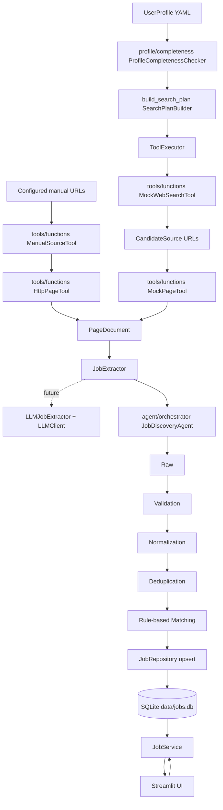

# Architecture

Job Radar is organized as a local-first Python application. The current phase proves the deterministic core of the larger job-search agent shown in `docs/job_search_agent_full_flow.svg`.

The target direction is:

```text
Program controls the workflow.
AI returns structured decisions.
Tools execute bounded actions.
Validation and persistence remain deterministic.
```

The current code should be viewed as the first working slice of that target system, not as the final agent.

## System Layers



## Target Agent Blueprint

The SVG in `docs/job_search_agent_full_flow.svg` is the long-term architecture reference. It separates the system into six phases:

1. User input and file handling.
2. User profile extraction and validation.
3. Search strategy and tool planning.
4. Tool execution and deterministic data processing.
5. Job understanding, matching, and iterative search decisions.
6. Persistence, Streamlit display, and user feedback.

The key rule is that AI never jumps the workflow directly. AI should return structured JSON decisions, then the orchestrator validates those decisions and decides what code or tool to run.

Examples:

```text
AI returns CandidateProfile
-> Program validates schema
-> Program merges accepted fields

AI returns ToolPlan
-> Program checks allowed tools, domains, budgets, and privacy rules
-> ToolExecutor runs web_search or acquire_page

AI returns MatchAssessment
-> Program validates score/reasons
-> Repository persists the accepted result
```

## Current Implementation vs Target Blueprint

| SVG phase | Target behavior | Current implementation |
| --- | --- | --- |
| User input and file handling | Upload resume, parse PDF/DOCX, accept free-form preferences. | Not implemented. Current profile comes from YAML. |
| User profile extraction | AI extracts `CandidateProfile` from resume and text. | Not implemented. `UserProfile` is loaded from YAML. |
| Profile completeness | Program checks required fields before search strategy generation. | Deterministic `ProfileCompletenessChecker` checks required fields outside AI tasks. |
| Search strategy | Deterministic `build_search_plan` generates bounded role-led queries. | A future builder may implement the shared Protocol without changing the Agent Tool boundary. |
| Tool planning | AI returns a validated `ToolPlan`. | Not implemented. Current executor is called in fixed order. |
| Search tools | `web_search`, company career search, API/MCP tools. | `MockWebSearchTool` and `ManualSourceTool`. |
| Page acquisition | Fetch URL, browser/site adapter if needed, return `PageDocument`. | `MockPageTool` and `HttpPageTool`. |
| Job extraction | Prefer LLM extraction for varied pages, then validate. | `RuleBasedJobExtractor`; `LLMJobExtractor` boundary exists for later. |
| Validation/normalization/dedup | Deterministic quality gate. | Implemented in `pipeline/`. |
| Job understanding | AI identifies hard requirements, eligibility, risks. | Not implemented. |
| Match analysis | AI/Rules calculate fit, gaps, recommendation, explanation. | Rule-based matcher only. |
| Continue decision | AI decides whether to search another round within limits. | Not implemented. |
| Persistence/UI/feedback | Save jobs, scores, run logs, user feedback. | SQLite jobs, status/notes, Streamlit table/export. |

This means the next major architecture step is not adding many page-specific `if/else` branches. The next step is introducing an explicit orchestrator and structured AI decision models while keeping profile completeness, pipeline validation, and persistence as deterministic safety layers.

## Dependencies

- `app.py` depends on services only.
- Services depend on pipeline components, agent setup, tools, AI tasks/providers, and repositories.
- The agent depends on AI tasks, extractor interface, and `ToolExecutor`.
- Future orchestrator growth should stay inside `agent/` and depend on AI decision models, tools, and services; lower layers should not depend on the orchestrator.
- Tools return structured models and do not write to storage.
- Pipeline components depend on models and configuration, not Streamlit.
- Storage owns SQL, database initialization, and inserted/updated/failed persistence counts.
- Tools and extraction steps return structured models and do not persist data.

This keeps UI, workflow control, tools, deterministic processing, and storage separate enough for future agent and matching improvements.

## Technology Choices

- Python 3.11+ keeps the project easy to clone and run locally.
- uv manages dependencies and local commands.
- Streamlit provides a minimal local interface without a frontend framework.
- SQLite is enough for local persistence and portfolio demonstration.
- pandas handles table display and export.
- Pydantic gives explicit raw and processed job models.
- PyYAML keeps profile and matching rules outside business code.
- pytest verifies the pipeline and repository without using the real database.
- The mock agent path uses mock web tools and deterministic rule-based extraction so tool scheduling can be tested without network access. Search-plan generation uses the deterministic builder.
- The manual URL path can fetch explicitly configured JD URLs with Python stdlib HTTP collection, but it does not discover URLs automatically.

## Agent And Tool Layer

The current agent implementation is a local skeleton for the SVG's agent/tool phases. The mock path runs:

```text
ProfileCompletenessChecker
-> build_search_plan/SearchPlanBuilder
-> ToolExecutor web_search
-> ToolExecutor acquire_page
-> RuleBasedJobExtractor
-> existing PipelineRunner
```

The manual URL path runs:

```text
ManualSourceTool configured URLs
-> ToolExecutor acquire_page
-> HttpPageTool
-> RuleBasedJobExtractor
-> existing PipelineRunner
```

This keeps deterministic code responsible for the steps that can already be tested locally. Future LLM extraction can be introduced by replacing `RuleBasedJobExtractor` with `LLMJobExtractor(real_client)` while the local pipeline remains the quality gate.

The future agent flow should add these explicit decision boundaries:

```text
CandidateProfileDecision
-> Python ProfileCompletenessChecker
-> SearchStrategy
-> ToolPlan
-> RawSearchResult[]
-> PageDocument
-> ExtractedJob[]
-> JobUnderstanding
-> MatchAssessment
-> ContinueDecision
```

Each AI-produced item should be a Pydantic model. AI may propose values, but code validates and applies them. Profile completeness is not AI-produced; Python required-field rules decide whether the workflow can continue.

## Adding Real Tools Later

A real tool should implement the `BaseTool` boundary and return structured models such as `CandidateSource`, `PageDocument`, or `RawJobRecord`. It should preserve `apply_url`, `source_url`, `source_name`, and `is_official` so downstream validation and persistence can keep source traceability.

Future tools can be added for company career sites, official campus recruitment pages, or imported files. They should not write directly to SQLite and should not bypass validation.

## Enhancing Matching

The current matcher is a transparent rules engine using profile preferences, keywords, company type, and location. It can be enhanced by:

- Adding configurable weights per role family.
- Using structured requirements extracted during normalization.
- Adding graduation-year and deadline scoring.
- Replacing the scoring function while preserving `match_score`, `match_reasons`, and `missing_requirements`.

Any stronger algorithm should keep explanations visible to the user.

## Extending Persistence

The current `jobs` table stores job facts plus user-managed `status` and `notes`. Re-importing the same deduplication key updates source facts and match fields but preserves `status` and `notes`. Future versions can add:

- Application event history.
- Reminder dates.
- Interview rounds.
- Offer details.
- Attachments or portfolio links.

User-managed fields must remain protected during re-imports.
