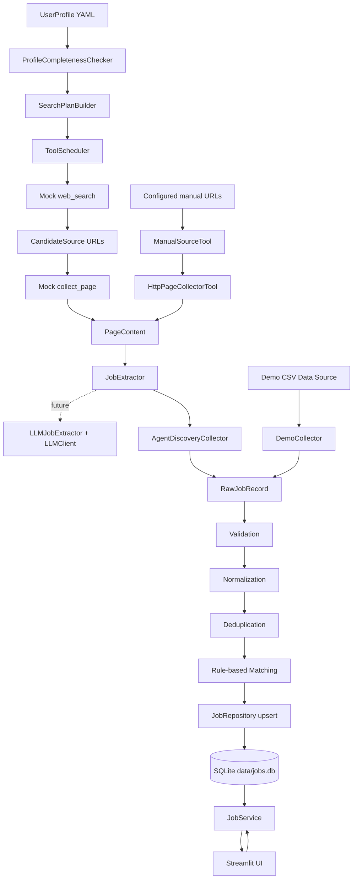

# Architecture

Job Radar is organized as a local-first Python application. The current phase proves the core boundaries and end-to-end data flow without implementing broad web crawling.

## System Layers



## Dependencies

- `app.py` depends on services only.
- Services depend on pipeline components, agent setup, tools, LLM abstractions, and repositories.
- Agents depend on the extractor interface and tool scheduler.
- Tools return structured models and do not write to storage.
- Pipeline components depend on models and configuration, not Streamlit.
- Storage owns SQL, database initialization, and inserted/updated/failed persistence counts.
- Collectors return `RawJobRecord` objects and do not persist data.

This keeps UI, business logic, and storage separate enough for future collectors and matching improvements.

## Technology Choices

- Python 3.11+ keeps the project easy to clone and run locally.
- uv manages dependencies and local commands.
- Streamlit provides a minimal local interface without a frontend framework.
- SQLite is enough for local persistence and portfolio demonstration.
- pandas handles CSV input and export.
- Pydantic gives explicit raw and processed job models.
- PyYAML keeps profile and matching rules outside business code.
- pytest verifies the pipeline and repository without using the real database.
- The mock agent path uses mock web tools and deterministic rule-based extraction so tool scheduling can be tested without network access.
- The manual URL path can fetch explicitly configured JD URLs with Python stdlib HTTP collection, but it does not discover URLs automatically.

## Agent And Tool Layer

The current agent implementation is a local skeleton for later AI skills. The mock path runs:

```text
ProfileCompletenessChecker
-> SearchPlanBuilder
-> ToolScheduler web_search
-> ToolScheduler collect_page
-> RuleBasedJobExtractor
-> AgentDiscoveryCollector
-> existing PipelineRunner
```

The manual URL path runs:

```text
ManualSourceTool configured URLs
-> ToolScheduler collect_page
-> HttpPageCollectorTool
-> RuleBasedJobExtractor
-> AgentDiscoveryCollector
-> existing PipelineRunner
```

This keeps deterministic code responsible for the steps that can already be tested locally. Future LLM extraction can be introduced by replacing `RuleBasedJobExtractor` with `LLMJobExtractor(real_client)` while the local pipeline remains the quality gate.

## Adding Real Collectors Later

A real collector should implement the same collector boundary as `DemoCollector`: collect source data and return `RawJobRecord` objects. It should preserve `apply_url`, `source_url`, `source_name`, and `is_official` so downstream validation and persistence can keep source traceability.

Future collectors can be added for company career sites, official campus recruitment pages, or imported CSV files. They should not write directly to SQLite and should not bypass validation.

## Enhancing Matching

The current matcher is a transparent rules engine using profile preferences, keywords, company type, and location. It can be enhanced by:

- Adding configurable weights per role family.
- Using structured requirements extracted during normalization.
- Adding graduation-year and deadline scoring.
- Replacing the scoring function while preserving `match_score`, `match_reasons`, and `missing_requirements`.

Any stronger algorithm should keep explanations visible to the user.

## Extending Persistence

The current `jobs` table stores job facts plus user-managed `status` and `notes`. Re-importing the same deduplication key updates source facts and match fields but preserves `status` and `notes`. Future versions can add:

- Application event history.
- Reminder dates.
- Interview rounds.
- Offer details.
- Attachments or portfolio links.

User-managed fields must remain protected during re-imports.
